# Elsa Moruno - Exercicis Recapitulació JS

Captures dels exercicis de recapitulació en el navegador

## Exercicis

### 1. Major de dos nombres

Funció que rep dos nombres i retorna el més gran.
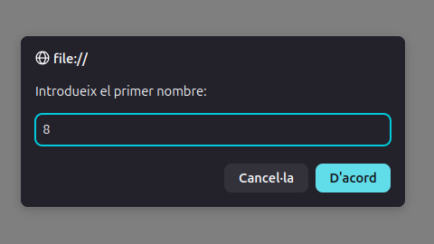
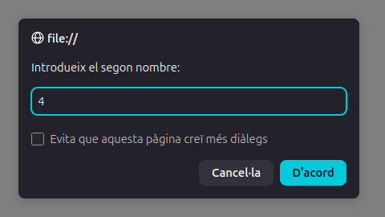
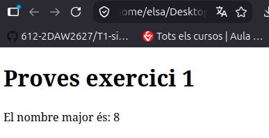

### 2. Nom d'una resolució

Funció que identifica una resolució a partir de la seva amplada i altura.

#### Exemple funcional:
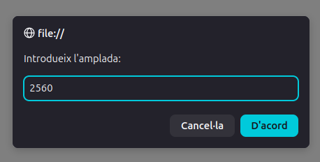
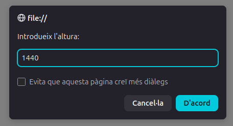
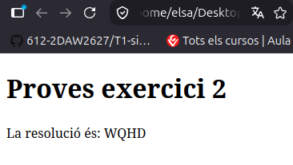

#### Exemple on no funciona (ho deixo buit):
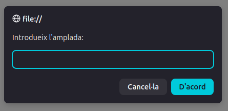
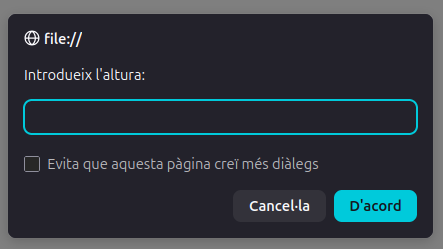
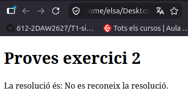


### 3. Element d'un array

Funció que retorna l'element d'un array a partir del seu índex.

#### Index vàlid
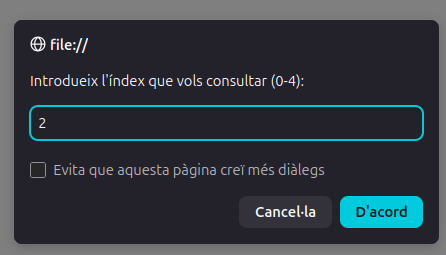
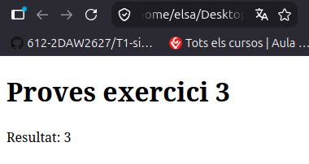

#### Index invàlid
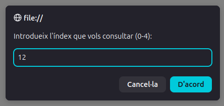
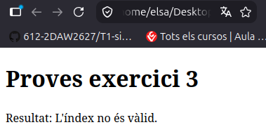

### 4. Nombres imparells

Programa que mostra els nombres imparells del 0 al 10 directament.
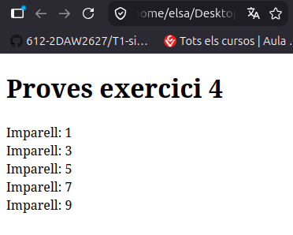


### 5. Nombre menor i major

Funció que busca el nombre menor i el nombre major d'un array (també directe, al codi).
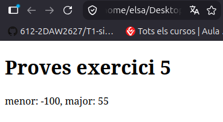

### 6. Comptar nombres positius

Funció que compta quants nombres positius hi ha en un array (també directe, al codi).
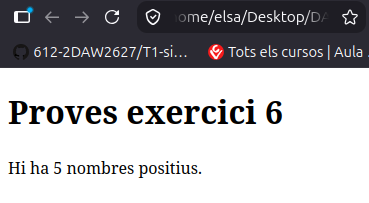

### 7. Preu amb impostos

Funció que calcula el preu final d'un producte aplicant un impost.
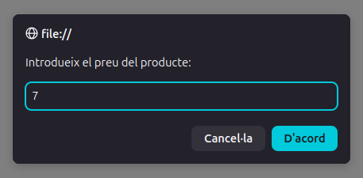
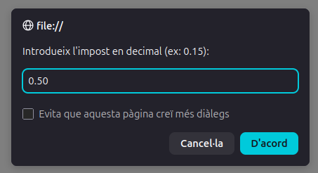
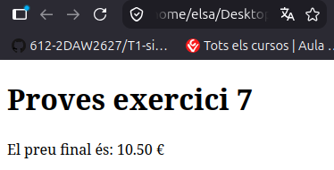

### 8. Convertir objectes en parelles

Transforma un array d'objectes en un array de parelles formades per l'id i l'objecte (al ex normal si es veu bé).
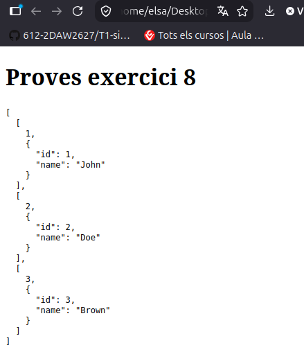


### 9. Convertir parelles en objectes

Transforma les parelles de l'exercici anterior en un array d'objectes (mateix comentari q en el 8).
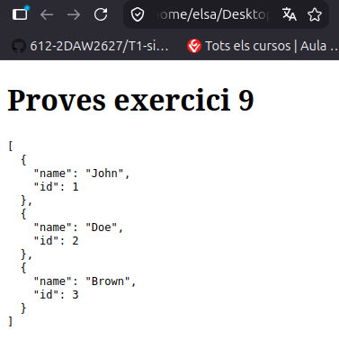

### 10. Crear un array

Funció que crea un array amb els nombres de l'1 fins a n.
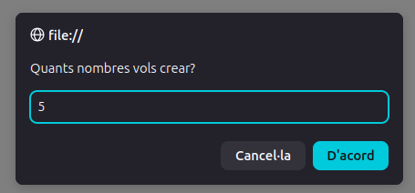
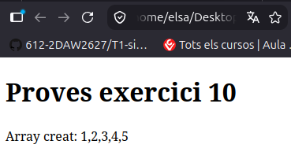

### Conclusió

Els exercicis han estat provats al navegador, he posat a tots casos alternatius, fet comentaris i apunts, funcionen totes. Porfa plis posam un 10 :)


---------------
## GitHub

Per al control de versions en repositori GitHub.

### 1. Inicialitzar el repositori Git i comprovar l'estat

```console
git init
git status
```

### 2. Afegir els fitxers a git

```console
git add .
```

### 3. Crear el 1r commit

```console
git commit -m "Exercicis de recapitulacio afegits"
```

### 4. Crear el repositori

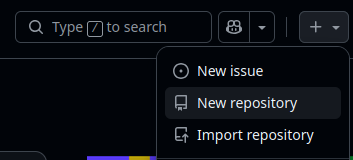
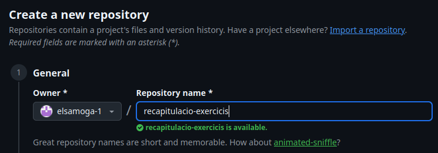

### 5. Connectar el repositori local amb GitHub
```console
git init
git status
git remote add origin git@github.com:elsamoga-1/recapitulacio-exercicis.git
git remote -v
```
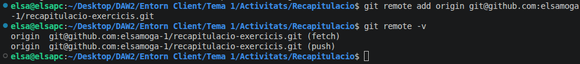

### 6. Main branca principal
```console
git branch -M main
```

### 7. Pujar a GitHyb
```console
git push -u origin main
```
